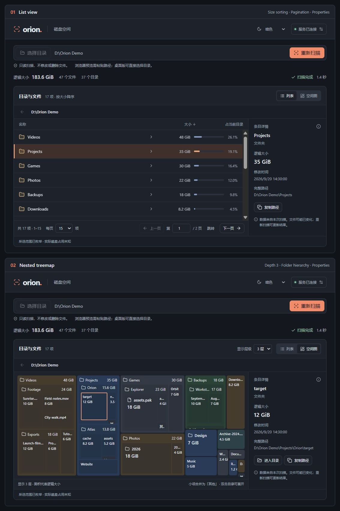

# Orion

简体中文 | [English](docs/README_EN.md)

Windows 优先的只读磁盘空间浏览器。独立 Rust Server 负责扫描与查询，Tauri / React 客户端负责桌面交互。



- **两种视图：** 在按大小排序的文件列表与嵌套矩形空间图之间切换，空间图支持 1–4 层深度调节。
- **高速扫描：** Rust 扫描引擎结合并行目录遍历、枚举元数据复用和批量索引更新，减少扫描开销。
- **独立 API：** 独立运行的 REST 服务支持 LLM Agent 和脚本发起扫描、查询空间占用、查看文件与目录详情，无需依赖桌面界面。参见 [API 使用说明](docs/API.md)。
- **跨平台潜力：** 基于 Rust 与 Tauri，具备扩展至 macOS 和 Linux 的基础。目前主要面向 Windows 开发与验证，其他平台尚未验证。

## 开发运行

需要 Rust / Cargo 1.92+、Node.js 22.12+（当前验证使用 24.12）、npm、Windows MSVC 构建工具和 WebView2。

首次在项目根目录安装前端依赖：

```powershell
npm ci
```

在项目根目录先编译后端，再启动桌面开发模式：

```powershell
cargo build -p orion-server
```

桌面会自动启动同目录下的后端程序：

```powershell
npm run desktop
```

选择目录后即可扫描、按大小浏览、进入子目录、查看详情或取消。点击窗口 X 会隐藏到系统托盘，扫描继续；单击托盘图标或再次打开应用会恢复窗口。右键托盘选择“退出 Orion”才会关闭后台；扫描中会确认是否停止扫描并退出。托盘菜单和提示显示后台状态。

桌面管理的后台只监听 `127.0.0.1`，使用系统分配的空闲端口。连接信息和日志放在 `%LOCALAPPDATA%\dev.orion.desktop\runtime`（`connection.json` / `server.log`），凭据目录限制当前 Windows 用户访问。桌面异常退出后，再打开会重连存活的后台；后台异常退出后，可在连接设置中点击“重新连接后台”。连接文件不要提交或分享。

独立调试后端仍可运行 `cargo run -p orion-server`，默认端口为 43120，连接文件为项目 `.orion/connection-43120.json`，在其终端按 Ctrl+C 停止。GUI 默认管理自己的后台；如需连接手动启动的 Server，在启动 GUI 的终端设置 `ORION_CONNECTION_FILE` 为该连接文件的绝对路径。此模式只连接已有后台，托盘退出也会停止它。Server 必须使用支持退出 API 的新版。

`ORION_RUNTIME_DIR` 可隔离开发数据目录，`ORION_SCAN_WORKERS` 配置扫描线程；独立 Server 还支持 `ORION_PORT`。Server 设置 `ORION_CONNECTION_FILE` 时，该文件必须在 `ORION_RUNTIME_DIR` 内。没有自定义启动脚本、开机启动项或 Windows 服务。开发热重载可能重连现有后台；修改后端代码后，需先从托盘退出、重新编译，再启动桌面。

扫描默认使用最多 4 个目录工作线程（不超过可用 CPU 并行度），每批最多 256 个条目更新索引。可在启动 Server 前设置 `ORION_SCAN_WORKERS` 为 1–16；例如 `$env:ORION_SCAN_WORKERS = '8'`，重启 Server 后生效，启动输出会显示实际配置。设置为 1 仍保留批量更新，适合比较并发本身的收益。

只看 Web 界面可运行 `npm run dev`，再在页面连接设置中填写本地连接文件的地址和令牌。浏览器预览需要手动输入目录路径；系统目录对话框与文件定位需在桌面客户端使用。

顶部的外观选择支持跟随系统、浅色和暗色，首次打开默认使用暗色。选择会保存在当前客户端，重启后恢复；跟随系统时会随系统主题实时切换。

Windows 桌面客户端支持 `Ctrl+-` 缩小、`Ctrl++`（或 `Ctrl+=`）放大、`Ctrl+0` 恢复默认缩放，也支持 `Ctrl+滚轮` 调整界面大小。正文默认约 14px，辅助信息约 11–13px。

## 常规检查

```powershell
cargo test --workspace
cargo fmt --all --check
cargo clippy --workspace --all-targets -- -D warnings
npm test
npm run build
```

生成包含前端资源的本机调试程序：先 `npm run build`，再 `cargo build -p orion-server -p orion-desktop --features orion-desktop/custom-protocol`。开发热更新使用前述 `npm run desktop`。生命周期集成测试使用隔离临时目录和临时端口，不操作正在使用的 Orion。

## Release 试用

在项目根目录运行 `npm run build`，然后执行：

```powershell
cargo build --locked --release -p orion-server -p orion-desktop --features orion-desktop/custom-protocol
```

产物是 `target/release/orion-server.exe` 和 `target/release/orion-desktop.exe`。两者放在同一目录，双击 `orion-desktop.exe` 即可，后端会自动启动且不弹出控制台。界面资源已嵌入，不需要 Vite 开发服务；目前是便携版，仍需系统具备 WebView2。

升级前先从托盘退出旧版；没有托盘的旧版需关闭客户端，并在旧 Server 终端按 Ctrl+C。然后双击新版桌面程序，或运行：

```powershell
.\target\release\orion-desktop.exe
```

当前扫描已默认复用 Windows 目录枚举提供的 metadata，减少逐文件路径查询。重新构建并重启 Server 后生效，已运行的旧进程不会自动更新。多次扫描会受 Windows 文件系统缓存和同时运行的程序影响，比较时记录扫描范围、耗时、文件数和异常数量。

## 项目结构

- `crates/orion-core`：目录枚举、索引、统计、取消与部分结果。
- `crates/orion-server`：本地 API、认证、共享任务和重复请求处理。
- `crates/orion-runtime`：无 Tauri 依赖的后台发现、HTTP 客户端和进程生命周期。
- `apps/desktop`：React UI 与 Tauri 桌面集成。
- `contracts/api-v1.json`：由 Rust 与 TypeScript 共同校验的 API 响应样本。
- `docs/`：公开文档，目前包含 [API 使用说明](docs/API.md) 和 [英文版 README](docs/README_EN.md)。

内部开发文档（产品草案、任务计划、架构与技术选型、评审记录、benchmark 报告）统一放在 `.local/docs/`，由 `.gitignore` 排除。新克隆或 worktree 不会自动包含这些本地资料，需要时单独复制。
