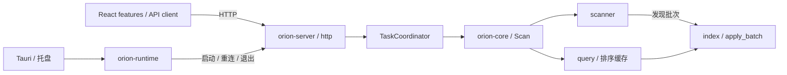

# 当前代码结构

2026-09-21 根据 [架构 Review](ARCHITECTURE_REVIEW.md) 调整。顶层仍是独立 Server 持有扫描和结果、各客户端通过 HTTP 使用同一份状态。

## 依赖与职责

生产依赖：`orion-server → orion-core`，`orion-desktop → orion-runtime`。runtime 不依赖扫描核心或 Tauri；Server 的进程集成测试以 dev-dependency 使用 runtime。

| 位置 | 职责 |
| --- | --- |
| `crates/orion-core/src/model.rs` | 扫描状态、条目和查询结果类型 |
| `crates/orion-core/src/scan.rs` | 对外 Scan 接口、根目录准备、取消及终态 |
| `crates/orion-core/src/scanner/` | 文件系统元信息、发现批次、队列和目录 worker |
| `crates/orion-core/src/index.rs` | 索引存储、批量提交、祖先汇总、目录排序版本 |
| `crates/orion-core/src/query.rs` | 目录分页、详情、容量受限的排序缓存 |
| `crates/orion-core/src/legacy_scan.rs` | 仅用于测试/benchmark 的串行历史对照 |
| `crates/orion-server/src/tasks.rs` | 单扫描、请求幂等、待启动请求、退出协调；不依赖 HTTP |
| `crates/orion-server/src/http/` | 认证、路由、wire DTO、应用错误映射 |
| `crates/orion-runtime/src/` | discovery、HTTP 客户端、进程启动和 supervisor |
| `apps/desktop/src-tauri/src/` | Tauri 窗口/托盘集成与状态文案 |
| `apps/desktop/src/features/session/` | 桌面发现和手动连接，屏蔽过期连接尝试 |
| `apps/desktop/src/features/scan/` | 健康/任务轮询、启动/取消、请求身份及异步响应顺序 |
| `apps/desktop/src/features/explorer/` | 浏览状态 reducer、分页/详情查询、目录展示 |
| `apps/desktop/src/lib/contracts.ts` | TS wire 类型与响应解码；desktop adapter 隔离原生 API |
| `contracts/api-v1.json` | Rust 序列化、Rust 客户端、TS 解码共同校验的协议样本 |

## 状态与锁约束

**前端**：连接和扫描操作使用同一 session 身份检查。启动/取消前后都递增 operation generation，使操作前或操作中的旧轮询不能回滚任务；同一任务的较低 revision 也不能覆盖新结果。新的有效轮询仍接受其他客户端替换的任务。断线或重连期间保留最后结果，暂停操作；实例改变或新任务出现后按任务 ID 重置浏览状态。超时或成功响应格式不明时保留原 request ID，重试继续关联同一次操作。

**任务协调**：短临界区预留请求；文件系统校验、创建等待提交的 worker 和旧索引释放均在任务锁外。提交时再次核对 shutdown，并在锁内释放 worker 的启动信号。相同 pending request ID 的调用等待同一份结果。失败和异常通过 reservation guard 清理；退出可阻止尚未提交的扫描运行。

**扫描与查询**：scanner 不修改 Entry 布局，由 `Index::apply_batch` 统一提交条目、问题、祖先汇总和 revision。文件系统 I/O 不持索引锁；持索引锁时不操作工作队列；所有 worker 退出后再进入终态。

目录查询缓存排序后的 ID，不复制第二份条目对象。缓存最多 32 个目录、总计 1,000,000 个 ID（64 位下约 7.63 MiB ID 数据，另有少量管理开销）；超过单目录上限则按原路径查询。索引为每个条目增加一个 u64 目录排序版本字段。子项增添或后代大小导致排序依据改变时，相关目录版本失效；枚举标志等非排序字段在每次响应时读取最新值。缓存命中时仅构造当前页；未命中时先取一致快照，再锁外排序。对外全局 revision 与过期检测保持原语义。

**后台生命周期**：启动与退出仍由 operation mutex 串行化；对外连接状态用另一个短锁发布。托盘 status 查询不持生命周期锁，也不在网络请求期间持状态锁；响应返回后检查连接身份，丢弃旧会话结果。状态以枚举返回，中文文案留在 Tauri。

## 契约变更

服务端 health、错误、请求和连接文件类型集中在 `http/contracts.rs`。任务/条目沿用 Core 的公开只读视图，避免维护两套同形模型。修改 wire 字段后，Rust fixture 测试必须与 `contracts/api-v1.json` 一致，前端和 runtime 同时读取该样本验证兼容性。

TS 实际请求也使用相同解码函数；缺失字段或类型变化会返回 `invalid_response`。新增未知任务状态显示为“未知任务状态”，允许读取已有结果并禁用发起扫描。新增额外字段可被忽略。请求错误继续兼容非 JSON 的 HTTP 4xx/5xx。

## 本轮验证

- 全 workspace Rust 29 项测试通过；另验证 benchmark feature、Clippy 全 target/feature、rustfmt。
- 前端 33 项测试、TypeScript 检查、Vite 生产构建通过。
- `orion-server` 与嵌入前端资源的 `orion-desktop` 本机调试构建通过。
- 回归覆盖旧轮询与启动/取消交错、连接切换、未确认响应的幂等重试、目录缓存失效及容量、校验期间查询/退出、重复启动、校验异常、原进程生命周期。
- 查询报告见 [query-cache.json](benchmarks/2026-09-21/query-cache.json)。10 万条目、每页 50 项，未缓存排序的中位耗时 20.1951 ms，缓存命中 0.0188 ms；首次缓存查询 22.3066 ms。40 对查询逐页比较完整 JSON，结果一致。
- [宽目录扫描报告](benchmarks/2026-09-21/scan-wide.json)（12,000 文件，4 对样本、1 次预热）正确性通过。此比较仍以历史串行为基线，不作为本轮重构相对于上一 commit 的性能变化结论。

查询基准隔离了内存索引成本，不代表 HTTP、UI 或整盘体验。并发发布的查询样本仅作诊断，数量见原报告；本次没有测进程峰值内存或原生托盘交互。容量边界由单元测试验证。真实整盘响应仍需后续试用。
