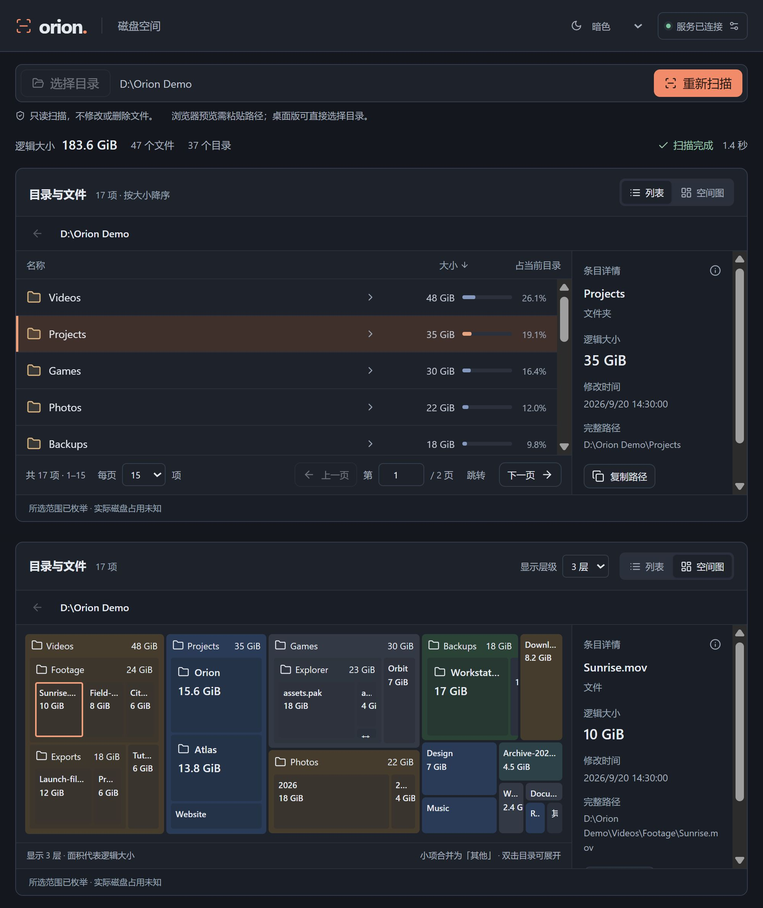

# Orion

[简体中文](../README.md) | English

A read-only disk space explorer built primarily for Windows. A standalone Rust server handles scanning and queries, while a Tauri / React client provides the desktop interface.



- **Two ways to explore:** switch between a size-sorted file list and a nested treemap with adjustable depth (1–4 levels).
- **Fast scanning:** a Rust scanner combines parallel directory traversal, reused enumeration metadata, and batched index updates to reduce scanning overhead.
- **Independent API:** a standalone REST server lets LLM agents and scripts start scans, query space usage, and inspect files and directories without relying on the desktop UI. See the [API guide](API.md).
- **Cross-platform potential:** built on Rust and Tauri, with a foundation for macOS and Linux support. Currently developed and validated primarily on Windows; other platforms are not yet verified.

## Development

Requires Rust / Cargo 1.92+, Node.js 22.12+ (tested with 24.12), npm, the Windows MSVC build tools, and WebView2.

Install the frontend dependencies from the repository root:

```powershell
npm ci
```

Build the backend before starting the desktop app in development mode:

```powershell
cargo build -p orion-server
```

The desktop app automatically starts the backend executable located in the same directory:

```powershell
npm run desktop
```

Select a directory to scan, browse entries by size, navigate into subdirectories, view details, or cancel the scan. Closing the window hides it in the system tray and lets scanning continue. Click the tray icon or open the app again to restore the window. Choose **Exit Orion** (退出 Orion) from the tray menu to shut down the backend. If a scan is running, the app asks whether to stop it and exit. The tray menu and tooltip display the backend status.

The backend managed by the desktop app listens only on `127.0.0.1`, using an available port assigned by the operating system. Connection information and logs are stored in `%LOCALAPPDATA%\dev.orion.desktop\runtime` (`connection.json` / `server.log`). Access to the credentials directory is restricted to the current Windows user. If the desktop app crashes, reopening it reconnects to a surviving backend. If the backend crashes, use **Reconnect backend** (重新连接后台) in the connection settings. Do not commit or share connection files.

For standalone backend debugging, run `cargo run -p orion-server`. The default port is 43120, and the connection file is `.orion/connection-43120.json` in the repository. Press Ctrl+C in its terminal to stop it. By default, the GUI manages its own backend. To connect to a manually started server, set `ORION_CONNECTION_FILE` to the absolute path of its connection file in the terminal used to launch the GUI. In this mode, the GUI only connects to an existing backend; exiting from the tray also stops that backend. The server must be a recent version that supports the shutdown API.

Use `ORION_RUNTIME_DIR` to isolate development runtime data and `ORION_SCAN_WORKERS` to configure scan workers. The standalone server also supports `ORION_PORT`. When the server uses `ORION_CONNECTION_FILE`, that file must be inside `ORION_RUNTIME_DIR`. Orion does not install custom startup scripts, startup entries, or Windows services. Development hot reload may reconnect to an existing backend. After changing backend code, exit from the tray, rebuild, and restart the desktop app.

Scanning uses up to 4 directory workers by default, limited by the available CPU parallelism, and updates the index in batches of up to 256 entries. Set `ORION_SCAN_WORKERS` to a value from 1 to 16 before starting the server, for example `$env:ORION_SCAN_WORKERS = '8'`. Restart the server for changes to take effect; its startup output shows the active configuration. Setting it to 1 retains batch updates, making it useful for comparing the effects of concurrency alone.

To preview the web interface, run `npm run dev`, then enter the URL and token from the local connection file in the page's connection settings. Browser previews require directory paths to be entered manually. The native directory picker and reveal-in-file-manager action are available in the desktop client.

The appearance selector at the top supports system, light, and dark themes, defaulting to dark on first launch. The selection is saved locally and restored on restart. System mode follows theme changes as they happen.

On Windows, the desktop client supports `Ctrl+-` to zoom out, `Ctrl++` (or `Ctrl+=`) to zoom in, and `Ctrl+0` to reset zoom. You can also use `Ctrl+mouse wheel`. Body text defaults to approximately 14 px, with secondary text around 11–13 px.

## Checks

```powershell
cargo test --workspace
cargo fmt --all --check
cargo clippy --workspace --all-targets -- -D warnings
npm test
npm run build
```

To build native debug executables with embedded frontend assets, run `npm run build`, followed by `cargo build -p orion-server -p orion-desktop --features orion-desktop/custom-protocol`. For development hot reload, use `npm run desktop` as described above. Lifecycle integration tests use isolated temporary directories and ports without touching a running Orion instance.

## Trying a release build

Run `npm run build` from the repository root, then:

```powershell
cargo build --locked --release -p orion-server -p orion-desktop --features orion-desktop/custom-protocol
```

This produces `target/release/orion-server.exe` and `target/release/orion-desktop.exe`. Keep both in the same directory and double-click `orion-desktop.exe`. The backend starts automatically without opening a console window. Frontend assets are embedded, so no Vite development server is required. The current build is portable and still requires WebView2 on the system.

Before upgrading, exit the old version from its tray menu. For older versions without a tray icon, close the client and press Ctrl+C in the old server's terminal. Then double-click the new desktop executable, or run:

```powershell
.\target\release\orion-desktop.exe
```

The scanner reuses metadata supplied by Windows directory enumeration by default, reducing per-file path queries. Backend changes require rebuilding and restarting the server; existing processes do not update automatically. Repeated scans are affected by the Windows filesystem cache and other running programs. When comparing results, record the scan scope, elapsed time, file count, and number of issues.

## Project structure

- `crates/orion-core`: directory enumeration, indexing, statistics, cancellation, and partial results.
- `crates/orion-server`: local API, authentication, shared tasks, and duplicate request handling.
- `crates/orion-runtime`: backend discovery, HTTP client, and process lifecycle management without a Tauri dependency.
- `apps/desktop`: React UI and Tauri desktop integration.
- `contracts/api-v1.json`: API response fixtures validated by both Rust and TypeScript.
- `docs/`: public documentation, including the [API guide](API.md) and [Chinese README](../README.md).
