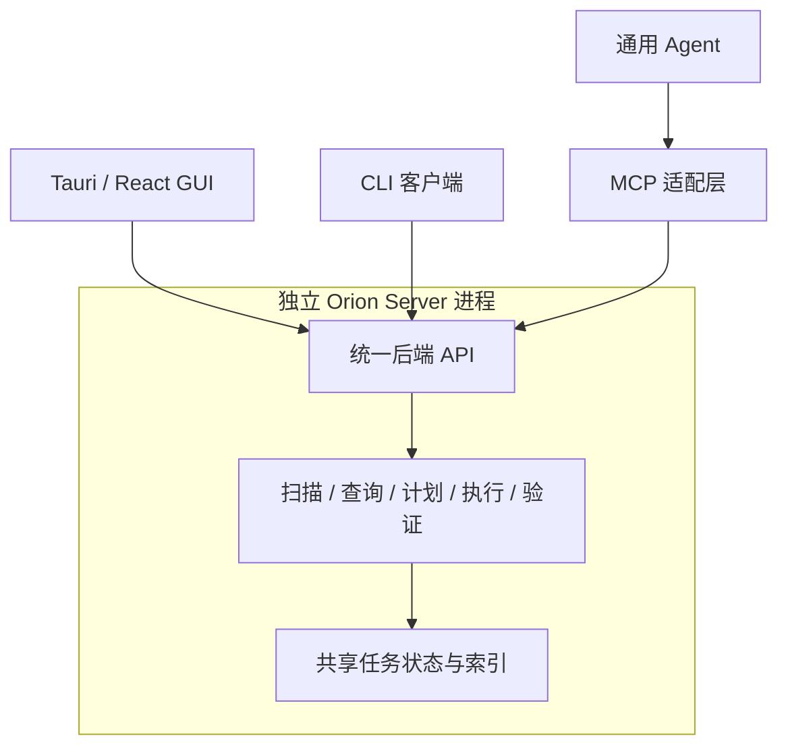

# Orion · 技术选型

本文记录架构决定、技术选择与理由。产品行为见 [Product Spec](PRODUCT_SPEC.md)，当前迭代范围、实现任务及验证事项见 [MVP Task Plan](MVP_TASK_PLAN.md)。

已采用：独立 Rust Server（Axum + Tokio），本地 HTTP / JSON API；GUI 使用 Tauri + React + TypeScript + Vite、shadcn/ui 风格的源码组件 + Tailwind、TanStack Virtual。后续 CLI / MCP 复用同一 API。

开发运行采用两个普通终端，分别执行 `cargo run -p orion-server` 和 `npm run desktop`，不使用自定义启动或停止脚本。具体步骤见 [README](../README.md)，已实现接口见 [API](API.md)。

## 建议组合

**独立 Rust Server + HTTP / JSON API + Tauri / React / TypeScript / Vite GUI。**

当前选择优先支持 UI 探索：利用 Web 布局、组件和可视化生态尝试不同的信息呈现方式。接受额外的前端工具链和桌面集成成本，业务能力始终保留在独立 Server 中。

| 部分 | 当前建议 | 理由与取舍 |
| --- | --- | --- |
| 核心能力与宿主 | Rust 核心库 + 独立 Server 进程 | 核心库便于测试，Server 统一持有任务、索引和操作约束；客户端通过 API 使用能力 |
| 客户端接口 | Axum + Tokio，HTTP / JSON | CLI、MCP、GUI 映射到同一业务语义；首轮使用轮询进度 |
| 桌面与界面 | Tauri + React，已选 | Tauri 承担桌面集成，React 探索列表、图形与混合布局 |
| 前端配套 | TypeScript + Vite，已选 | 约束客户端数据形状，提供开发与构建流程 |
| UI 基础 | shadcn/ui 风格的源码组件 + Tailwind 4 | 当前 Button 使用 Radix Slot / cva；按需引入，不预建完整组件集 |
| 大列表 | TanStack Virtual，已采用 | 按可见区域渲染；需要复杂表格状态时再加入 TanStack Table |
| 状态归属 | 后端持有任务与结果，前端持有交互状态 | 扫描、索引和后续清理计划由后端管理；展开、选中、搜索输入等由界面管理 |
| 扫描 | 普通目录枚举 + 后台工作线程 | 先建立真实可用的扫描基线，支持部分结果、取消和错误记录 |
| 扫描数据 | Server 内存索引，建议 | 客户端重连可查询存活 Server 的结果；重启恢复需要持久化，当前限制见迭代计划 |
| 构建工具 | Cargo + npm，建议 | 分别管理 Rust 与前端依赖，初始化时确定兼容版本并提交锁文件 |

## 独立 Server 与统一 API

GUI、CLI 和 MCP 都通过同一套 API 使用后端，不在各入口嵌入独立扫描引擎或直接访问后端存储。API 表达操作请求、查询结果和任务进展；客户端可以各自提供更适合人的输出或 Agent 工具描述。

- 后端负责扫描、数据查询、任务生命周期，以及后续清理规则、授权校验、执行与验证。
- GUI 负责展示与交互；CLI 负责参数及输出；MCP 适配层负责工具描述和协议映射；Agent 负责目标理解与编排。
- 任务、扫描结果和清理计划由 Server 唯一管理。客户端使用任务或计划标识查询同一份状态，不能通过本地副本绕过执行约束。
- 长任务的生命周期独立于一次 API 请求和客户端连接。关闭 GUI 或断开 MCP 连接不自动取消扫描；取消通过明确的 API 操作发起。
- 清理规则、访问范围、授权校验和重复请求处理在 Server 内生效。统一 API 不代表各客户端自动获得相同权限。

### 服务边界

- 本地单用户服务与系统常驻服务是不同的部署选择，启动方式不改变后端对任务状态的所有权。
- 客户端必须能区分服务未启动、连接中断和任务失败。重连后按标识查询原任务，不能因请求超时就认定操作未执行。
- 数据查询支持分页；耗时扫描在后台执行，API 保持响应。
- 本地 HTTP 仅绑定 `127.0.0.1`，使用每次启动生成的随机 Bearer 令牌；凭据写入当前用户受限目录。浏览器来源白名单只涵盖 Vite 开发地址与 Tauri。回环监听和 CORS 均不代替认证。

独立进程增加启动、连接、版本兼容和异常退出处理成本；换来唯一的运行状态和客户端独立性，这是本项目接受的架构取舍。Server 进程独立不等于任务已经持久化，服务重启恢复仍需另做设计。

### 后端内部：对象、能力与任务

核心代码区分三个职责，按实际能力组织模块，不要求提前拆成多层框架或多个服务：

| 职责 | 典型内容 | 边界 |
| --- | --- | --- |
| 领域对象 | 扫描范围、文件条目、扫描结果、任务状态 | 描述业务含义与约束，不依赖 HTTP、MCP、Tauri 或数据库类型 |
| 应用能力 | 发起扫描、控制任务、查询占用与对象 | 组织一次操作，协调任务与索引，对所有客户端保持相同语义 |
| 系统适配 | 目录枚举、Windows 元信息读取，后续存储 | 提供具体系统访问实现，不承担页面交互逻辑 |

领域对象随实际功能增加；模块划分不等于提前引入插件加载或通用 Agent Runtime。

- **API 按业务职责设计。** 扫描请求给定范围并返回任务标识，查询请求给定扫描标识和筛选条件并返回数据。它们已经可以是领域能力，使用 RPC 或 REST 不决定抽象质量，也不应依赖“当前页面”或“当前选中目录”。
- **基础查询与组合能力并存。** 保留扫描、目录查询和对象详情；有真实需求时增加占用汇总、候选解释等组合能力。后续清理按“生成计划 → 执行计划 → 验证结果”提供，不开放绕过检查的任意路径删除入口。
- **MCP 映射能力，不复制规则。** 可以把多个只读查询组合为方便 Agent 使用的工具，但领域分析与执行规则留在 Server；仅暴露已经实现的能力，不为追求高层命名引入无明确定义的“智能分析一切”。
- **任务是后端的一等数据。** 包含标识、类型、状态、进度、起止时间、结果引用和错误；结果完整性另行表达，不把“有部分结果”等同于全量成功。
- **任务控制跟实际能力走。** 发起任务后独立查询或取消，重复请求及断线重连关联原任务；未支持的状态和恢复行为不能伪装为可用。
- **状态先可查询，再考虑通知。** 若增加进度事件，它用于提示刷新，完整状态仍可查询，断线后能重新获取。

### 通信选型的比较口径

区分业务契约、编码与传输方式，再选择具体组合。HTTP、Named Pipe 和 gRPC 不在同一个抽象层次，不能简单作三选一比较。

- **本地 HTTP + JSON：** 作为候选保留，重点比较 React 接入和调试便利性，以及端点发现、认证和浏览器访问约束的成本。
- **Windows Named Pipe：** 避免 TCP 端口分配，可通过 Windows 安全描述符控制访问；仍需明确配置权限，不是自动仅允许当前用户访问。GUI 可由 Tauri 原生侧转发，转发本身不构成第二套业务后端。[Microsoft 权限说明](https://learn.microsoft.com/en-us/windows/win32/ipc/named-pipe-security-and-access-rights)
- **gRPC / Protobuf：** 若契约生成和流式通信收益足够，再考虑其额外工具链。React WebView 路径还需评估 gRPC-Web 或原生桥接，不假定浏览器可以直接使用原生 gRPC。[gRPC-Web 协议说明](https://github.com/grpc/grpc/blob/master/doc/PROTOCOL-WEB.md)

首轮采用 HTTP / JSON：React 直接连接，后续 CLI / MCP 可直接复用且方便调试；暂不引入桥接层、Protobuf 或推送通道。默认端口 43120，连接文件提供地址与令牌；进度以 800 ms 间隔轮询，避免请求重叠。依赖的准确版本记录在 Cargo.lock / package-lock.json。[Axum 服务入口](https://docs.rs/axum/latest/axum/fn.serve.html)

## GUI 选择：优先支持界面探索

选择 Tauri + React，主要理由是需要探索适合磁盘管理的信息呈现方式。React 组件、CSS 布局和可视化工具便于尝试列表、卡片、图形及其组合，具体 UI 不提前锁死。

- **React 管理展示和交互。** 组件通过客户端 API 层访问 Server，便于更换页面而不重写请求逻辑；连接真实数据前可以使用相同数据形状的样例验证布局。
- **Tauri 作为桌面外壳。** 负责窗口、文件夹选择、系统文件定位等桌面集成。Tauri 自身的 Rust 进程与 Orion Server 是不同角色，扫描、索引和清理逻辑留在独立 Server。
- **GUI 仍使用统一后端 API。** 根据通信方案选择由 React 直接连接或经 Tauri 转发；两种方式都不能另建一套只供 GUI 使用的业务逻辑。
- **运行成本具体衡量。** WebView、消息传输和 React 更新都有成本，但不能据此预判 Orion 一定卡顿。后端分页、筛选和聚合，前端只渲染可见列表项，进度适度合并；扫描和全量计算不进入界面线程。
- **按使用体验验证。** 重点看不同布局的可理解性、大列表滚动、中文输入、高 DPI，以及空闲和扫描时的资源占用。发现瓶颈后先定位原因，不预设以后必须重写 GUI。

Tauri 在 Windows 上使用 WebView2；其官方文档也提供了 Vite 的集成配置。[Tauri 进程模型](https://v2.tauri.app/concept/process-model/)、[Vite 集成](https://v2.tauri.app/start/frontend/vite/)

egui / iced 保留为曾评估的备选；目前不并行实现多套 GUI。选择 Tauri / React 是针对当前 UI 探索需求的取舍，尚无各框架的性能实测结论。

### UI 组件方案：shadcn/ui + Tailwind

建议用 shadcn/ui 提供基础组件，Tailwind 和共享样式变量调整布局、间距与主题。shadcn/ui 将组件源码加入项目，适合迭代修改；相应地，我们需要维护引入的代码并选择性合并上游修复。其官方提供 React / TypeScript / Vite 接入方式。[组件模式](https://ui.shadcn.com/docs)、[Vite 接入](https://ui.shadcn.com/docs/installation/vite)

| Orion 需要的交互 | 建议实现 |
| --- | --- |
| 按钮、搜索框、提示、弹窗与进度 | 按需引入 shadcn/ui 组件，统一密度和焦点样式 |
| 可调整的导航区、内容区、详情区 | 使用 Resizable 组合面板，布局可随实验改变 |
| 行右键操作、更多操作菜单 | 使用 Context Menu / Dropdown Menu，接入选中项与操作权限 |
| 大量文件列表 | TanStack Virtual 按可见范围渲染，数据仍由后端分页、筛选和排序 |
| 多列排序、列宽及选择状态 | 需求复杂时引入 TanStack Table，避免最初就建立完整数据网格 |

面板和右键菜单有现成组件。[Resizable](https://ui.shadcn.com/docs/components/base/resizable)、[Context Menu](https://ui.shadcn.com/docs/components/base/context-menu)。表格与虚拟化是两个职责，不能把 shadcn 的 Data Table 示例当作完整文件浏览器。[TanStack 虚拟化说明](https://tanstack.com/table/v8/docs/guide/virtualization)、[TanStack Virtual](https://tanstack.com/virtual/latest/docs/introduction)

桌面体验还需要应用层补齐：键盘导航、选择行为、右键与当前选择的关系、焦点恢复、高 DPI 和中文输入。虚拟化列表还要处理离屏行的键盘导航与可访问性；不因采用现成组件就默认具备完整树形浏览或拖放能力。窗口操作、原生文件夹对话框和系统文件定位由 Tauri 提供集成；基础 React 组件不替代这些能力。

只选一套基础组件体系，按页面需要引入；底层原语实现与依赖版本保持统一。图表库等确定展示形式后再选择，不限制后续 UI 探索。

备选包括 [Mantine](https://mantine.dev/getting-started/)（希望更多现成组件时）、[Ant Design](https://ant.design/components/table/)（表格和表单成为主要工作量时）、[Fluent UI](https://github.com/microsoft/fluentui)（希望围绕微软设计体系组织界面时）。当前以定制自由度为主要依据推荐 shadcn/ui，不宣称它在性能或可访问性上优于这些方案。

## 扫描与数据处理建议

- **扫描与界面分开：** 耗时遍历放到专用后台工作线程。进度合并发送，界面按需获取列表，避免逐文件推消息、复制整棵树或长时间持锁阻塞界面。
- **先建立普通扫描基线：** 建议使用 `std::fs::read_dir`，遇到需要补充的 Windows 元信息时再调用系统 API。标准库当前在 Windows 上使用原生目录枚举接口。[Rust 文档](https://doc.rust-lang.org/std/fs/fn.read_dir.html)
- **保留统计边界：** 内存索引避免每个对象重复存完整路径；链接和权限错误单独处理，实际占用无法确定时标为未知。用真实大目录观察耗时、内存和交互，再决定并行策略或磁盘索引。

## 尚未确定的技术选择

- **MFT / USN：** 用于评估全盘加速与增量更新；普通目录扫描保留为基础路径，性能差异通过实测判断。
- **数据库：** 根据持久化与数据规模需求评估 SQLite 等方案，不能把进程内存当作持久化存储。
- **后端 API 后续演进：** 当前选型已落地；若实际需求表明轮询不足，再评估事件推送、契约生成或其他传输。
- **CLI / MCP：** 通过统一后端 API 共享能力与任务；SDK、工具列表和 MCP 适配层的进程部署方式在接入阶段决定。
- **外围依赖：** Tauri / React 及组件依赖的具体版本、图表库、并行库及 Windows API 封装按实际需要选择，避免第一步就固定整套依赖。
- **扩展机制：** 新扫描方式和清理规则先用普通模块扩展；出现独立发布或第三方扩展的实际需求后，再讨论插件契约。当前不建立插件运行时，也不自动向 MCP 发布动态插件能力。
